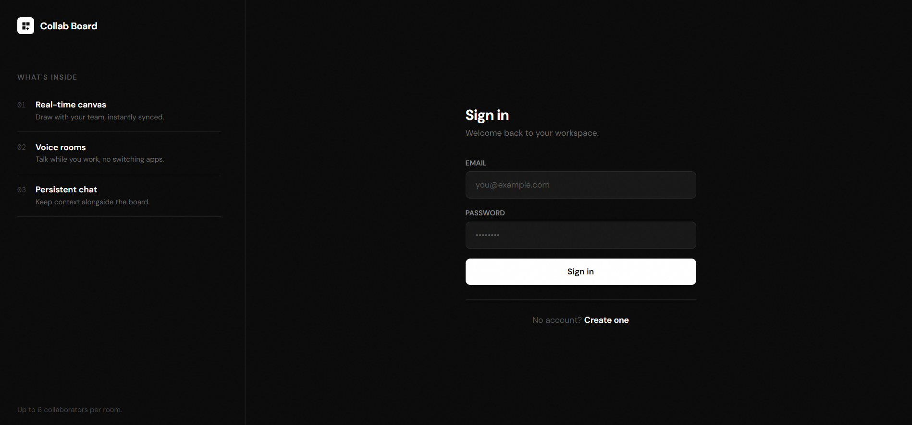
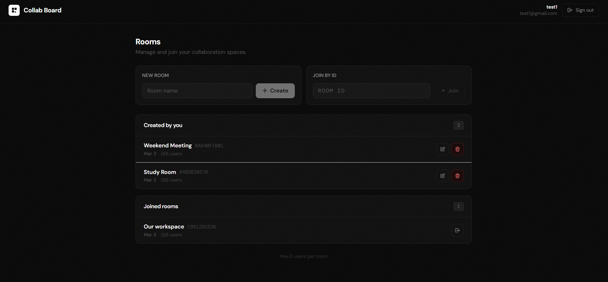
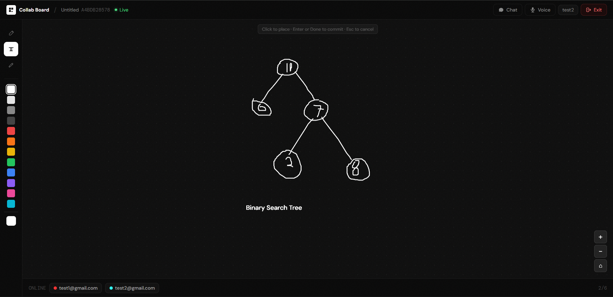
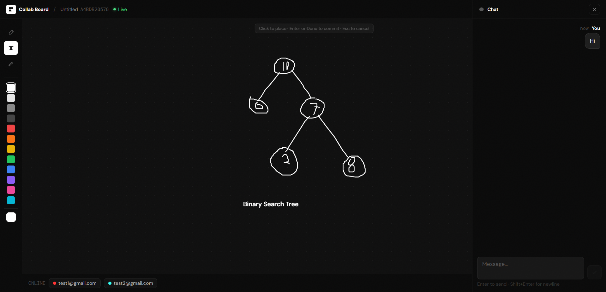

# Collaborative Board

Collaborative Board is a real-time multi-user whiteboard platform where teams can draw, chat, and coordinate in shared rooms.

Live demo: https://coboardapp.netlify.app/









## Project overview

This project is built as a full-stack collaborative system with:
- Live drawing synchronization
- Room-based user presence
- Real-time chat
- Voice signaling/mic state indicators
- JWT-secured authentication and room access

Each room supports up to **6 concurrent users**.

## Core features

- Authentication: Register/login with JWT-based authorization
- Room management: Create, join, rename, leave, and delete rooms
- Real-time whiteboard: Multi-user drawing/text/erase sync via WebSocket (STOMP + SockJS)
- Presence: Live user list with active participants in each room
- Chat: Real-time room chat with persisted history
- Voice status: Mic state visibility for participants
- Persistence: Board/chat data backed by PostgreSQL, with Redis used for real-time board action buffering

## Architecture

- Frontend connects to backend REST APIs for auth, room metadata, history, and persistence operations
- Frontend connects to backend WebSocket endpoint for low-latency real-time events
- Backend enforces room-level authorization for protected WebSocket topics and REST endpoints
- Redis stores transient board actions; snapshots/history persist to PostgreSQL

## Tech stack

### Frontend
- React 19
- Vite 5
- Tailwind CSS
- STOMP client + SockJS

### Backend
- Spring Boot 4
- Spring Security (JWT)
- Spring WebSocket (STOMP)
- Spring Data JPA
- Actuator

### Data layer
- PostgreSQL (primary persistence)
- Redis (realtime/cache layer)

### DevOps / Hosting
- Backend: Render
- Redis: Render
- Database: Neon
- Frontend: Netlify

## Repository structure

```text
.
├─ backend/       Spring Boot API + WebSocket server
├─ frontend/      React client application
├─ docker-compose.yml
└─ production.md  Deployment checklist and production setup
```

## Local run (quick start)

```bash
# infra
Docker: postgres + redis (optional pgadmin) via docker-compose

# backend
cd backend
./mvnw spring-boot:run

# frontend
cd frontend
npm install
npm run dev
```

Frontend env vars (from `frontend/.env.example`):
- `VITE_API_BASE_URL`
- `VITE_WS_URL`
- `VITE_ICE_SERVERS` (JSON array string; include TURN for production reliability)
- `VITE_DEBUG_LOGS`

Backend important env vars:
- `DATABASE_URL`
- `REDIS_URL`
- `JWT_SECRET`
- `FRONTEND_URL`
- optional `JPA_DDL_AUTO`, `PORT`


## Author

real-time collaborative system with production-focused backend/frontend hardening.
